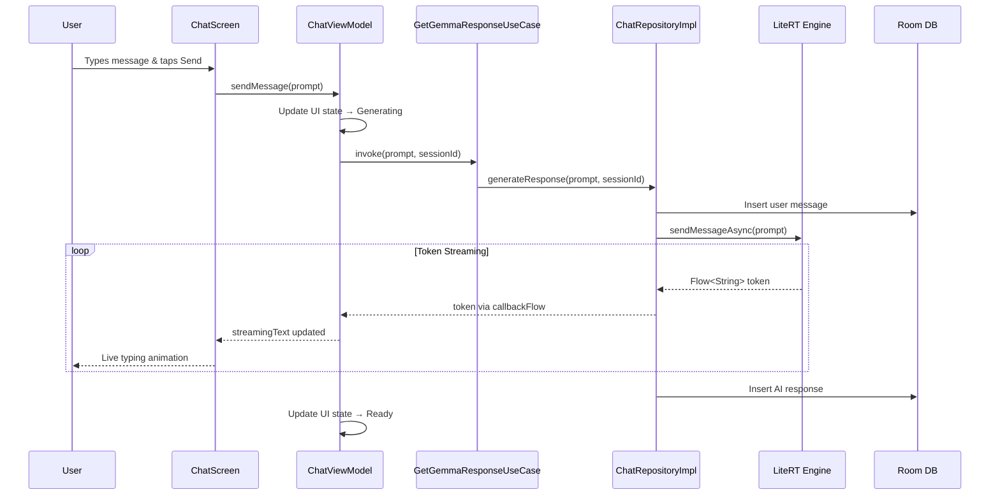

<p align="center">
  <h1 align="center">🤖 Gemma Edge — On-Device AI Assistant</h1>
  <p align="center">
    <em>A portfolio project demonstrating production-grade Android architecture with on-device LLM inference.</em>
  </p>
  <p align="center">
    
    
    
    
    
    
  </p>
</p>

---

## 📌 About This Project

> **This is a portfolio / interview showcase project.** It was built to demonstrate my approach to modern Android development — specifically around **multi-module Clean Architecture**, **reactive state management**, and **on-device AI integration** using Google's Gemma model.

The app is a native Android AI chatbot — conceptually similar to Google Gemini — but designed to run **100% offline** on the device. All inference happens locally through the **LiteRT LLM** runtime (formerly TensorFlow Lite), ensuring complete data privacy with zero cloud dependency.

### What This Project Demonstrates

| Skill Area | What I Built |
|---|---|
| 🏗️ **Architecture** | Multi-module Clean Architecture with strict dependency inversion — `:app`, `:domain`, `:data`, `:feature:*`, `:core:*` |
| 🧩 **Dependency Injection** | Full Hilt graph with `@Binds`, `@Provides`, scoped `@Singleton` bindings across module boundaries |
| ⚡ **Reactive Streams** | End-to-end `Flow`/`StateFlow` pipeline from LiteRT engine → Repository → UseCase → ViewModel → Compose UI |
| 🤖 **On-Device AI** | LiteRT LLM integration with async token streaming, engine lifecycle management, and OOM-safe teardown |
| 🎨 **Modern UI** | Jetpack Compose with Material 3, animated typing indicators, streaming chat bubbles, navigation drawer |
| 💾 **Persistence** | Room database for multi-session chat history with reactive `Flow`-based queries |
| 🔄 **State Management** | Sealed class–based MVI pattern (`Initial → LoadingModel → Ready ⇄ Generating → Error`) |

---

## 🛠️ Tech Stack

| Layer | Technology |
|---|---|
| **Language** | Kotlin |
| **UI Framework** | Jetpack Compose (Material 3) |
| **AI Runtime** | [LiteRT LLM](https://ai.google.dev/edge/litert) `0.10.2` (formerly TF Lite) |
| **Model** | Gemma 4 E2B-IT (`.litertlm` format) |
| **Architecture** | Multi-Module Clean Architecture (MVVM) |
| **Dependency Injection** | Hilt `2.59.2` |
| **Async / Reactive** | Kotlin Coroutines & Flow / StateFlow |
| **Local Storage** | Room `2.8.4` (chat history) |
| **Navigation** | Jetpack Navigation Compose `2.9.8` |
| **Build System** | Gradle Version Catalog (`libs.versions.toml`) + KSP |

---

## 🏗️ Architecture

The project follows **Clean Architecture** with a strict multi-module structure, enforcing the dependency rule: outer layers depend inward, never the reverse.

### Module Graph

```
┌──────────────────────────────────────────────────────┐
│                        :app                          │
│          MainActivity • Navigation • Theme           │
└──────────┬──────────────┬──────────────┬─────────────┘
           │              │              │
    ┌──────▼──────┐ ┌─────▼─────┐ ┌─────▼──────┐
    │ :feature:   │ │ :feature: │ │  :core:ui  │
    │    chat     │ │ settings  │ │  (Design   │
    │ (Screen,    │ │           │ │   System)  │
    │  ViewModel) │ │           │ │            │
    └──────┬──────┘ └───────────┘ └────────────┘
           │
    ┌──────▼──────┐
    │   :domain   │
    │  UseCases   │
    │  Models     │
    │  Repository │
    │  (interface)│
    └──────┬──────┘
           │
    ┌──────▼──────────────────────────────────────────┐
    │                    :data                         │
    │   ChatRepositoryImpl • LiteRT Engine • Mappers   │
    └──────┬────────────┬──────────────┬──────────────┘
           │            │              │
    ┌──────▼──────┐ ┌───▼────────┐ ┌──▼──────────┐
    │  :core:     │ │ :core:     │ │ :core:      │
    │  database   │ │ datastore  │ │ network     │
    │  (Room)     │ │            │ │             │
    └─────────────┘ └────────────┘ └─────────────┘
```

### Modules

| Module | Responsibility |
|---|---|
| `:app` | Application entry point, Hilt setup, root navigation graph, theme, splash screen |
| `:feature:chat` | Chat UI (`ChatScreen`), `ChatViewModel`, and Compose components (`ChatBubble`, `ChatInputBar`, `TypingIndicator`, `ChatHistoryDrawer`, `ErrorView`) |
| `:feature:settings` | Model configuration and app settings UI |
| `:domain` | Pure Kotlin — `ChatRepository` interface, `GetGemmaResponseUseCase`, domain models (`ChatMessage`, `ChatSession`) |
| `:data` | `ChatRepositoryImpl` — LiteRT engine wrapper, token streaming, Room persistence bridge |
| `:core:database` | Room database (`AppDatabase`), `ChatDao`, entity definitions |
| `:core:ui` | Shared design system and navigation route definitions |
| `:core:datastore` | DataStore preferences |
| `:core:network` | Network layer abstractions |
| `:core:utils` | Shared utility functions |

### Data Flow — UI to LiteRT Engine



---

## ✨ Features

- **🔐 Fully Local Inference** — All AI processing runs on-device via LiteRT. No data ever leaves the phone.
- **⚡ Real-Time Token Streaming** — Responses stream token-by-token with `Flow`-based reactive pipeline.
- **🎭 Animated Typing Indicator** — Three-dot bounce animation using `infiniteRepeatable` keyframe animations.
- **💬 Multi-Session Chat History** — Create, switch, and resume conversations — all persisted via Room.
- **🎨 Material 3 Theming** — Material You / Dynamic Color with edge-to-edge rendering.
- **📝 Markdown Rendering** — Bold text in AI responses is parsed and rendered with proper `AnnotatedString` typography.
- **🚀 Splash Screen** — AndroidX SplashScreen API for a polished launch experience.

---

## 🚀 Setup & Running

### Prerequisites

- **Android Studio** Ladybug (2024.2.1) or later
- **JDK** 11+
- **Android SDK** API 36 (compile) / API 24+ (min)
- A physical Android device (**recommended**) — on-device LLM inference is resource-intensive

### 1. Clone the Repository

```bash
git clone https://github.com/Dhanasekaran-zha/Gemma-LiteRTlm.git
cd Gemma-LiteRTlm
```

### 2. Open in Android Studio

Open the project root in Android Studio. Gradle sync will resolve all dependencies via the version catalog.

### 3. Model Integration

The Gemma model file is **not** included in the repo due to its size. You must download and place it manually.

**a)** Download the **Gemma LiteRT LLM** model (`.litertlm` format) from:
> 🔗 [Google AI Edge — Gemma Models](https://ai.google.dev/edge/mediapipe/solutions/genai/llm_inference#gemma)

**b)** Install & launch the app once (this creates the required directory), then push the model:

```bash
adb push gemma-4-E2B-it.litertlm /storage/emulated/0/Android/data/com.gemmaEdge/files/
```

**c)** If your model file has a different name, update the reference in `ChatRepositoryImpl.kt`:

```kotlin
// 📁 data/src/main/java/com/data/repository/ChatRepositoryImpl.kt

val modelFile = File(
    context.getExternalFilesDir(null),
    "gemma-4-E2B-it.litertlm"  // ← Update this to match your file name
)
```

### 4. Build & Run

Click **▶ Run** in Android Studio, or:

```bash
./gradlew installDebug
```

> [!WARNING]
> On-device LLM inference is memory-intensive. A device with **6 GB+ RAM** is recommended.

---

## 📂 Key Files Reference

| File | Path | Purpose |
|---|---|---|
| `ChatRepositoryImpl` | `data/.../repository/ChatRepositoryImpl.kt` | LiteRT engine lifecycle, streaming inference, Room bridge |
| `ChatRepository` | `domain/.../repository/ChatRepository.kt` | Repository contract (interface) |
| `GetGemmaResponseUseCase` | `domain/.../usecase/GetGemmaResponseUseCase.kt` | Domain use case orchestrating chat operations |
| `ChatViewModel` | `feature/chat/.../ui/chat/ChatViewModel.kt` | UI state management, MVI event handling |
| `ChatScreen` | `feature/chat/.../ui/chat/ChatScreen.kt` | Main Compose chat interface |
| `ChatUiState` | `feature/chat/.../ui/chat/ChatUiState.kt` | UI state + sealed `ChatStatus` |
| `AppDatabase` | `core/database/.../AppDatabase.kt` | Room database definition |
| `ChatDao` | `core/database/.../dao/ChatDao.kt` | DAO for sessions & messages |
| `RepositoryModule` | `data/.../di/RepositoryModule.kt` | Hilt binding: `ChatRepositoryImpl` → `ChatRepository` |
| `UseCaseModule` | `domain/.../di/UseCaseModule.kt` | Hilt provider for `GetGemmaResponseUseCase` |

---

## 🧪 Testing

The project includes testing infrastructure with:

- **JUnit 4** — Unit test framework
- **MockK** — Kotlin-first mocking
- **Turbine** — `Flow` testing
- **Coroutines Test** — `runTest`, `TestDispatcher`

```bash
./gradlew test
```

---

## 📄 License

This project is built for **educational, portfolio, and interview demonstration purposes**. The Gemma model is subject to [Google's Gemma Terms of Use](https://ai.google.dev/gemma/terms).

---

<p align="center">
  Built with ❤️ by <a href="https://github.com/Dhanasekaran-zha">Dhanasekaran</a> — Kotlin · Jetpack Compose · On-Device AI
</p>
